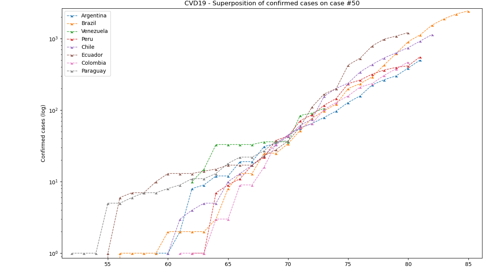

# pyCOVID
**Plot coronavirus cases/deaths over time by country.**

### Plot Logarithmic curves too
`getData.py` gets cases online and saves them to a .csv file. 
`process.py` can plot the data obtained. It's all very basic support, use my code for your own ends.

### Examples
Find the examples at the bottom of [`process.py`](process.py)
